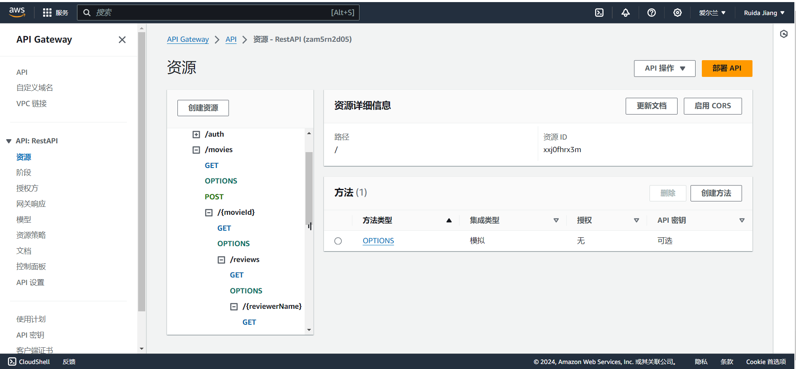
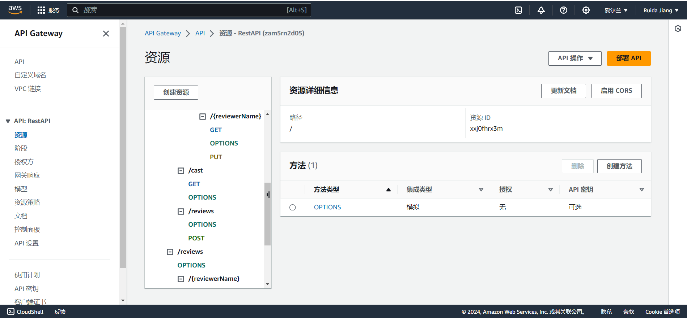
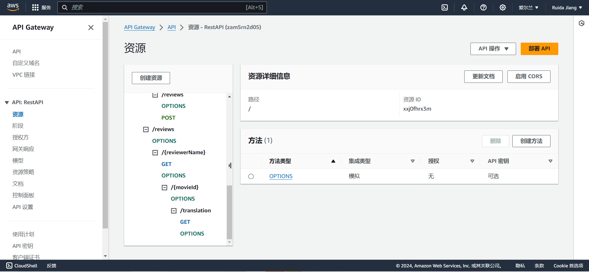
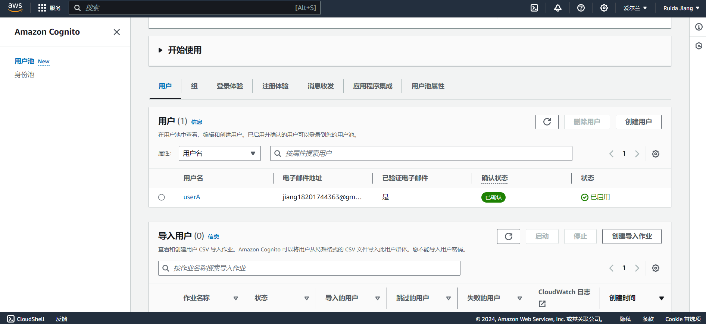
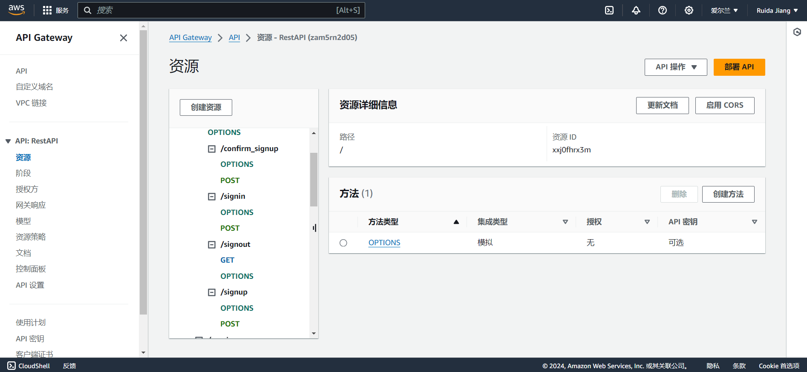

## Serverless REST Assignment.

__Name:__ Ruida Jiang

__Video demonstration:__ https://www.youtube.com/watch?v=W2cD7rLwX-s

This repository contains an implementation of a serverless REST API for the AWS platform. The CDK framework is used to provision its infrastructure. The API's domain context is movie reviews.

### API endpoints.

[ Provide a bullet-point list of the app's endpoints (excluding the Auth API endpoints you have successfully implemented in full. Omit those in the assignment specification that you did not complete.]
e.g.

+ POST /movies/reviews - add a movie review.
+ GET /movies/{movieId}/reviews - Get all the reviews for a movie with the specified id.
+ GET /movies/{movieId}/reviews?minRating=n - Get all the reviews for the film with the specified ID whose rating was higher than the minRating.
+ GET /movies/{movieId}/reviews/{reviewerName} - Get the review for the movie with the specified movie ID and written by the named reviewer.
+ PUT /movies/{movieId}/reviews/{reviewerName} - Update the text of a review.
+ GET /movies/{movieId}/reviews?year=n - Get the reviews written in a specific year for a specific movie.
+ GET /reviews/{reviewerName} - Get all the reviews written by a specific reviewer.
+ GET /reviews/{reviewerName}/{movieId}/translation?language=code - Get a translated version of a movie review using the movie ID and reviewer name as the identifier.

### Authentication (if relevant).

### Independent learning (If relevant).

In this experiment, I learned and used Amazon Translate, and successfully introduced Amazon Translate into my lambda function by imitating the related tutorial of web links; After deploying the additions, I noticed that the policies for my IAM role did not have access to the Amazon Comprehend service. So I found the corresponding IAM role according to the search information and added the permission policy. Finally, I re-tested the function to confirm that it was resolved.

